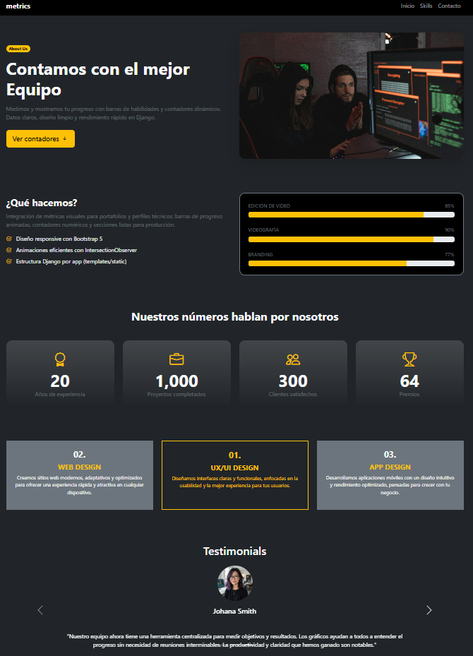

# web con metricas y contadores

web donde se muestra ademas de la informacion, el uso de metricas y contadores animados que se cargan al rehiciar la pagina, Toda la información puede ser gestionada desde el panel de administración.

## Vista previa


## Características

- Página principal con presentación personal.
- Sección sobre educación y experiencia profesional.
- Panel de administración para gestionar contenido.
- Listado de metricas en barras de crecimiento horizontal.
- Listado de metricas en contadores numericos.
- banner final con boton de contacto.
- seccion de enlaces de contacto.
- Backend desarrollado con Django 5.2.4.


## ⚙️ Instalación

Sigue estos pasos para correr el proyecto en tu máquina local:

1. Clona el repositorio:
   ```bash
   https://github.com/luisAngelDev/django-simple-blog.git
   cd blog-personal
   ```

2. Crea y activa un entorno virtual:
   ```bash
   python -m venv venv
   venv\Scripts\activate  # En Windows
   ```

3. Instala las dependencias:
   ```bash
   pip install -r requirements.txt
   ```

4. Aplica las migraciones:
   ```bash
   python manage.py migrate
   ```

5. Inicia el servidor:
   ```bash
   python manage.py runserver
   ```

6. Accede al sitio en tu navegador:
   ```
   http://127.0.0.1:8000/
   ```

   
## 🔐 Acceso al panel de administración

Puedes acceder al panel de administración de Django en:

```
http://127.0.0.1:8000/admin
```

> ⚠️ Necesitas crear un superusuario:
> ```bash
> python manage.py createsuperuser
> ```


## 📂 Estructura del proyecto

django-skill-metrics/
├── manage.py
├── django_skill_metrics/ # Configuración principal del proyecto
│ ├── settings.py
│ ├── urls.py
│ ├── wsgi.py
│ └── asgi.py
│
├── metrics/ # App principal
│ ├── migrations/ # Migraciones de base de datos
│ ├── models.py
│ ├── views.py
│ ├── urls.py
│ ├── admin.py
│ └── templates/
│ └── metrics/
│ └── our_metrics.html # Página principal con métricas
│
├── static/ # Archivos estáticos
│ └── metrics/
│ ├── img/ # Imágenes del sitio
│ ├── css/ # Estilos CSS
│ │ └── styles.css
│ └── js/ # Archivos JS
│ └── metrics.js
│
├── templates/ # Plantillas generales
│ └── base.html
│
├── venv/ # Entorno virtual (ignorado por git)
├── .gitignore
├── README.md
├── requirements.txt
└── .env # Variables de entorno (ignorado por git)

## 👨‍💻 Autor

**Luis Ramos**  
[GitHub: @luisAngelDev](https://github.com/luisAngelDev) 

## 📄 Licencia
Este proyecto está bajo la Licencia MIT - consulta el archivo [LICENSE](./LICENSE) para más detalles.
